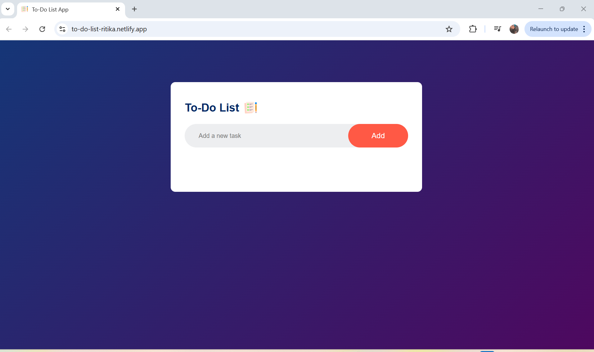
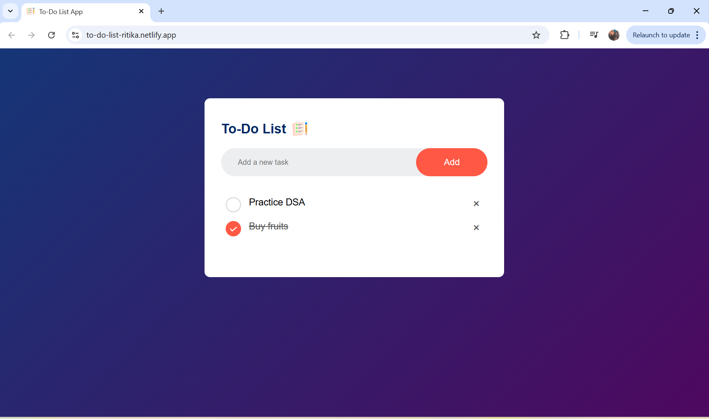

# 📝 Responsive To-Do List App

A clean and responsive **To-Do List web application** built using **HTML, CSS, and JavaScript**. It lets users manage their daily tasks effectively — with persistent storage using **localStorage** and a smooth, mobile-friendly interface.

🚀 **Live Demo:**  
👉 [to-do-list-ritika.netlify.app](https://to-do-list-ritika.netlify.app/)

---

## ✨ Features

- ✅ Add new tasks
- ✏️ Mark tasks as completed (toggle)
- ❌ Delete tasks with a single click
- 💾 Automatically saves tasks to **localStorage**
- 📱 Fully responsive design (desktop + mobile)
- 🌐 Includes custom favicon (`icon.png`)

---

## 📂 Project Structure

📁 to-do-list-app/<br>
│<br>
├── 📄 index.html<br>
├── 📄 style.css<br>
├── 📄 script.js<br>
└── 📁 images/<br>
├── icon.png<br>
├── checked.png<br>
├── unchecked.png<br>
└── screenshot.png<br>

---

## 📸 Screenshots

### 📌 Empty State:


### 📌 Tasks Added:



---

## 🧑‍💻 Technologies Used

- **HTML5**
- **CSS3** (Flexbox, Media Queries)
- **Vanilla JavaScript** (DOM Manipulation + LocalStorage)

---

## ⚙️ How to Use

1. **Clone the repository:**

   ```bash
   git clone https://github.com/yourusername/to-do-list-app.git
   cd to-do-list-app
2. **Open index.html in your browser.**
   
